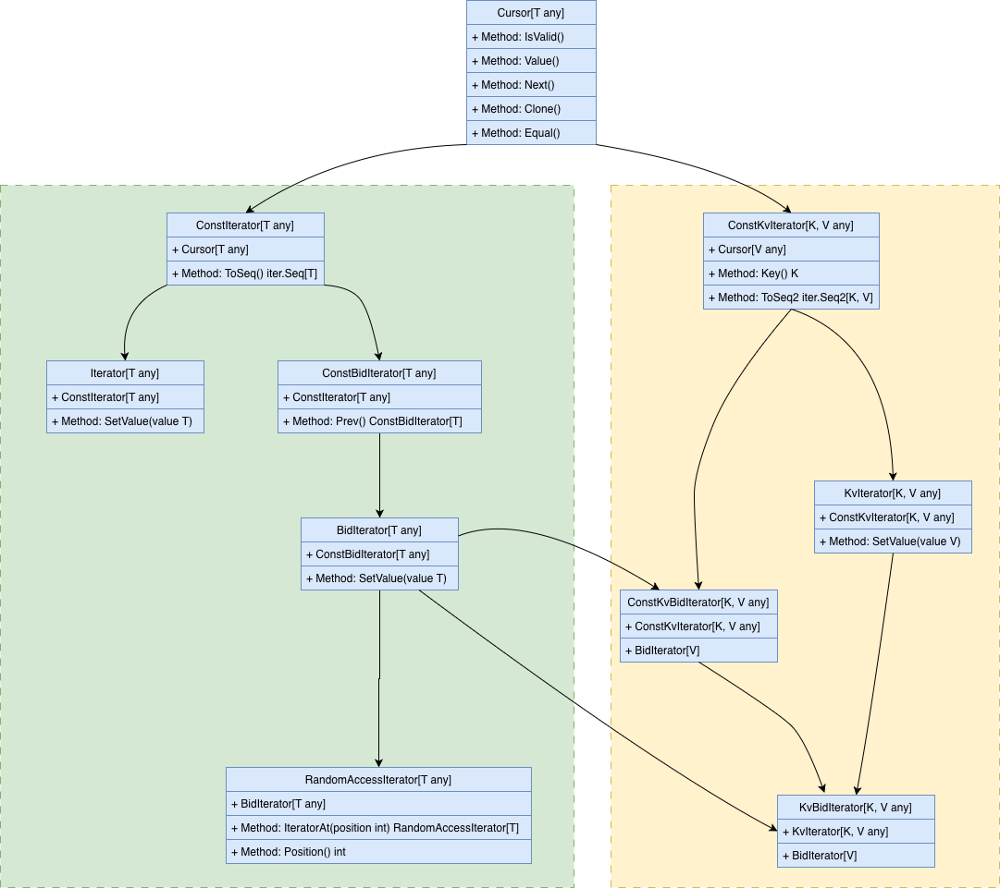

# SPG (Standard Package for GO)
Try implementing the STL and some tools in GO.
Study the gostl project and improve on its basis


## 迭代器接口
其中`Cursor[T]`作为基础的迭代器拥有基础的功能
1. 当前指向的位置是否有效
2. 获取当前指向位置的Value
3. 获取下一个位置的游迭代器
4. 克隆当前迭代器
5. 判断当前两个迭代器是否相等
```go
type Cursor[T any] interface {
    IsValid() bool          // 判断迭代器是否有效
    Value() T              // 获取当前值
    Next() Cursor[T]       // 移动到下一个位置
    Clone() Cursor[T]      // 克隆迭代器
    Equal(other Cursor[T]) bool // 比较两个迭代器
}
```

下分两个分支
1. 线性迭代器（`ConstIterator`）
   a. 扩展`Cursor[T]`，增加GO1.23+的`iter.Seq[T]`的集成，用于实现`range`遍历
2. 键值对迭代器（`ConstKvIterator[K,V]`）
   a. 扩展`Cursor[T]`，增加`GO1.23+`的`iter.Seq2[K,V]`的集成，用于实现`range`遍历
   b. 增加`Key() K`方法获取`Key`值


```go
Cursor[T]                         (基础游标接口)
    ├── ConstIterator[T]          (只读单向迭代器)
    │       ├── Iterator[T]        (可写单向迭代器)
    │       └── ConstBidIterator[T] (只读双向迭代器)
    │               └── BidIterator[T] (可写双向迭代器)
    │                       └── RandomAccessIterator[T] (随机访问迭代器)
    │
    └── ConstKvIterator[K,V]      (只读键值迭代器)
            └── KvIterator[K,V]    (可写键值迭代器)

其中
ConstKvBidIterator[K, V any] 只读单向键值迭代器
KvBidIterator[K, V any] 可读写双向键值迭代器
```

## 比较器设计

## 访问者模式
```go
type Visitor[V any] func(value V) bool

type KvVisitor[K, V any] func(key K, value V) bool
```

示例:
```go
l.Traversal(func(v int) bool {
    fmt.Println(v)
    return true // 根据此处返回决定遍历是否终止
})
```


## 锁设计

## Acknowledgements
This project is inspired by or uses parts of [gostl](https://github.com/liyue201/gostl).
We appreciate the work done by the original authors.